# Azure Cloud Provider Caching Architecture

The Azure cloud provider supports both cached and direct API modes to optimize API calls and handle varying Azure API throttling scenarios. Here's how both modes work:

## Operating Modes

The Azure cloud provider can operate in two modes:

### **Cached Mode (Default)**
Traditional caching approach with configurable TTLs and intelligent invalidation.

### **Direct Mode**
New non-cached mode that makes immediate Azure API calls, bypassing all caching layers.

**Configuration**: Set `DisableCaching=true` in Azure configuration or `AZURE_DISABLE_CACHING=true` environment variable.

## Cache Components (Cached Mode)

### 1. **azureCache** (`azure_cache.go:58-107`)
The main cache that tracks cluster resources (cached mode only):
- **Resource tracking**: Maps scale sets, VMs, and node pools
- **Instance-to-nodegroup mapping**: `instanceToNodeGroup` maps instances to their node groups
- **Refresh interval**: Configurable TTL (default 1 minute via `AZURE_VMSS_CACHE_TTL`)
- **Thread-safe**: Protected by `sync.Mutex`

### 2. **InstanceCache** (`azure_scale_set_instance_cache.go:55-71`)
Per-ScaleSet instance tracking (cached mode only):
- **Instance details**: Caches `cloudprovider.Instance` objects for each VMSS
- **Refresh period**: 5 minutes (configurable via `VmssVmsCacheTTL`)
- **Jitter support**: Prevents thundering herd with `instancesRefreshJitter`

### 3. **SKU Cache** (`azure_cache.go:126`)
VM SKU information cache (both modes):
- **Third-party library**: Uses `skewer.Cache` for Azure VM SKU data
- **Location-specific**: Filters SKUs by Azure region
- **Dynamic instance types**: Enables runtime SKU discovery

## Direct Mode Components

### **DirectResourceCache** (`azure_direct_cache.go`)
Non-caching implementation that makes immediate Azure API calls:
- **No caching**: All operations result in direct Azure API calls
- **Stateless**: No internal state maintained between calls  
- **Thread-safe**: Inherently safe due to stateless design
- **Interface compliance**: Implements `ResourceCache` interface with no-op cache methods

### **ResourceCache Interface** (`azure_cache_interface.go`)
Abstract interface that enables polymorphic behavior:
- **Factory pattern**: `newResourceCache()` selects implementation based on `DisableCaching` config
- **Uniform API**: Both cached and direct modes expose same interface to `AzureManager`
- **Backward compatibility**: Existing code works unchanged with both implementations

## Data Flow Patterns

### Cached Mode Data Flow (`azure_manager.go:216-236`)
```
AzureManager.Refresh() → forceRefresh() → azureCache.regenerate()
├── fetchAzureResources() - Gets VMSS/VM lists from Azure API
├── Update instanceToNodeGroup mapping
└── Reset unownedInstances cache
```

### Direct Mode Data Flow
```
AzureManager operations → DirectResourceCache methods → Immediate Azure API calls
├── getScaleSets() - Direct Azure VMSS List API call every time
├── getVirtualMachines() - Direct Azure VM List API call every time  
└── getVMsPoolMap() - Direct Azure Agent Pool List API call every time
```

### Instance Cache Refresh (`azure_scale_set_instance_cache.go:90-119`) - Cached Mode Only
```
ScaleSet operations → validateInstanceCache() → updateInstanceCache()
├── Check lastInstanceRefresh + refreshPeriod vs current time
├── Call Azure VMSS VMs List API if stale
└── Update instanceCache with current VM status
```

### Resource Fetching Strategy
**Cached Mode** (`azure_cache.go:233-260`):
1. **VMSS List**: `fetchScaleSets()` - Gets all scale sets in resource group
2. **VM List**: `fetchVirtualMachines()` - Gets standalone VMs grouped by agent pool
3. **VMs Pools**: `fetchVMsPools()` - Gets AKS VMs-type agent pools (if enabled)

**Direct Mode** (`azure_direct_cache.go`):
1. **VMSS List**: Direct API call on every `getScaleSets()` access
2. **VM List**: Direct API call on every `getVirtualMachines()` access  
3. **VMs Pools**: Direct API call on every `getVMsPoolMap()` access

## Cache Invalidation Patterns

### Cached Mode Invalidation
**Automatic Invalidation**:
- **Time-based**: Each cache has its own TTL (1min azureCache, 5min instanceCache)
- **On registration changes**: `invalidateUnownedInstanceCache()` when node groups change
- **On scaling operations**: `invalidateInstanceCache()` forces immediate refresh

**Manual Invalidation** (`azure_manager.go:238-243`):
- **Force refresh**: `invalidateCache()` sets `lastRefresh` to past time
- **Triggered by**: Node group registration/unregistration, scaling operations

### Direct Mode Invalidation
**No caching means no invalidation**:
- **Always fresh**: Every operation gets the latest data from Azure API
- **No-op methods**: `Cleanup()`, `regenerate()`, and invalidation methods do nothing
- **No TTL concerns**: Eliminates cache staleness issues entirely

## Access Patterns

### Cached Mode Access Patterns
**Read Operations**:
- **GetNodeGroupForInstance**: `azureCache.FindForInstance()` uses `instanceToNodeGroup` map
- **ScaleSet.Nodes()**: Returns cached instances from `InstanceCache.instanceCache`
- **Instance lookups**: `getInstanceByProviderID()` searches instance cache

**Write Operations**:
- **Registration**: Updates `registeredNodeGroups` and rebuilds mappings
- **Status updates**: `setInstanceStatusByProviderID()` modifies cached instance status
- **Scaling decisions**: Updates both size tracking and instance caches

### Direct Mode Access Patterns
**Read Operations**:
- **GetNodeGroupForInstance**: Direct lookup through Azure API calls
- **ScaleSet.Nodes()**: Direct Azure VMSS VMs List API call every time
- **Instance lookups**: Live API queries for current instance state

**Write Operations**:
- **Registration**: Maintains minimal nodegroup list, no cache updates
- **Status updates**: Not applicable (no cached status to update)
- **Scaling decisions**: Immediate Azure API calls, no cache invalidation needed

## Performance Optimizations

### Cached Mode Optimizations
**Locking Strategy**:
- **Granular locks**: Separate mutexes for different cache components
- **Lock-free reads**: Some operations use lock-free patterns where safe
- **Minimize critical sections**: Fetch data outside locks, then update atomically

**Batch Operations**:
- **Bulk fetching**: Single API calls retrieve multiple resources
- **Parallel updates**: Multiple caches can refresh concurrently
- **Jittered refresh**: Prevents simultaneous cache refreshes across scale sets

**Memory Efficiency**:
- **Reference sharing**: Maps use references to avoid data duplication  
- **Selective caching**: Only caches actively managed resources
- **Cleanup**: `azureCache.Cleanup()` properly closes channels and releases resources

### Direct Mode Optimizations
**Simplicity Over Speed**:
- **No locks needed**: Stateless design eliminates concurrency concerns
- **No memory overhead**: No data structures to maintain or clean up
- **Always accurate**: Never returns stale data, eliminates cache consistency issues

**Trade-offs**:
- **Higher API usage**: Every operation makes Azure API calls
- **Increased latency**: No local cache means network round-trip for each query
- **Rate limiting sensitivity**: More susceptible to Azure API throttling

## Mode Selection Guidelines

### Use Cached Mode When:
- **High read frequency**: Frequent queries to cluster state
- **API rate limits**: Azure API throttling is a concern
- **Stable clusters**: Infrastructure changes infrequently
- **Memory available**: Can afford cache memory overhead

### Use Direct Mode When:
- **API improvements**: Azure API throttling has been resolved
- **Dynamic environments**: Infrastructure changes frequently
- **Accuracy critical**: Always need the latest state from Azure
- **Memory constrained**: Cannot afford cache memory overhead

The Azure cloud provider's dual-mode approach allows users to choose the best strategy based on their specific Azure API performance characteristics and application requirements.

# Azure Cloud Provider Architecture Diagrams

## 1. Dual-Mode Architecture Overview

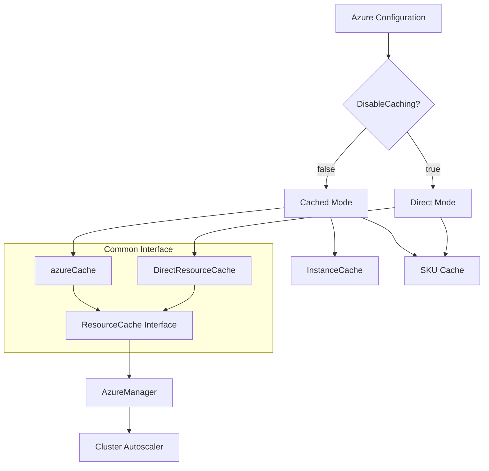

## 2. Cache Component Hierarchy (Cached Mode)

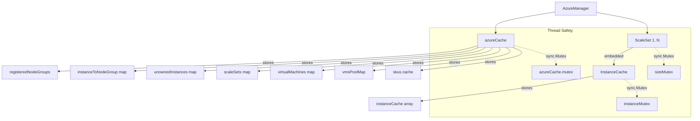

## 3. Direct Mode Data Flow

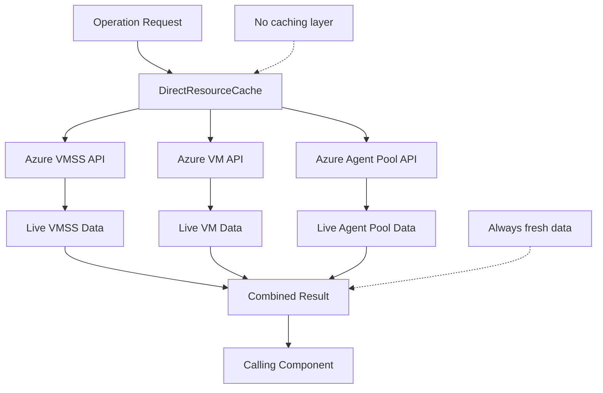

## 4. Cache Refresh Flow (Cached Mode)

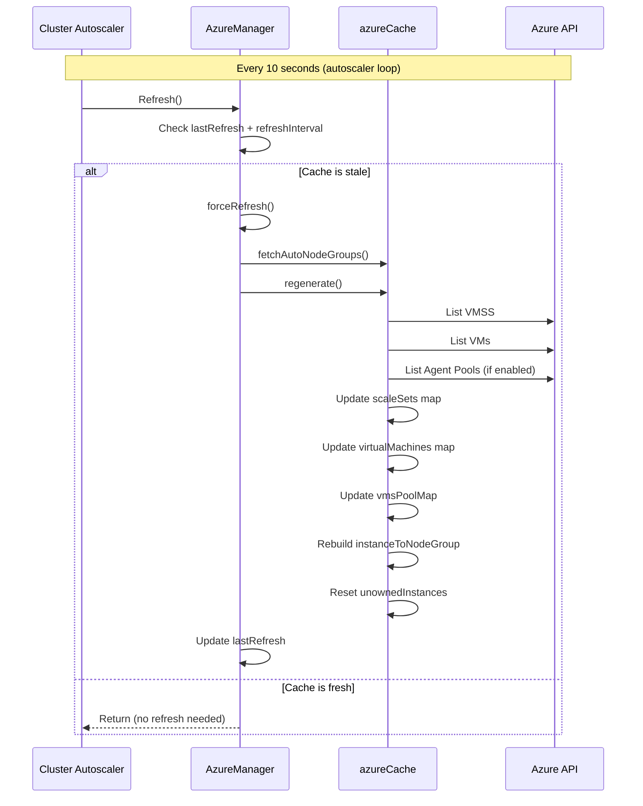

## 3. Instance Cache Lifecycle

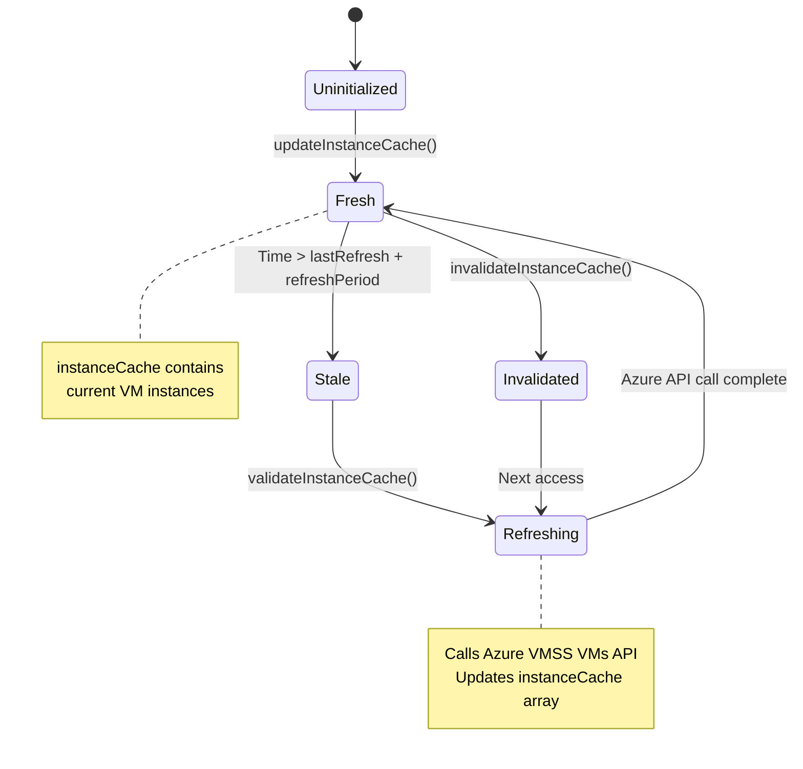

## 4. Data Flow for Node Group Operations

```mermaid
flowchart TD
    subgraph "Node Group Lookup"
        A[GetNodeGroupForInstance] --> B[azureCache.FindForInstance]
        B --> C{Check unownedInstances}
        C -->|Found| D[Return nil]
        C -->|Not found| E[Search instanceToNodeGroup]
        E -->|Found| F[Return NodeGroup]
        E -->|Not found| G[Return nil + cache as unowned]
    end
    
    subgraph "Instance Operations"
        H[ScaleSet.Nodes] --> I[validateInstanceCache]
        I --> J{Cache valid?}
        J -->|Yes| K[Return cached instances]
        J -->|No| L[updateInstanceCache]
        L --> M[Call Azure VMSS VMs API]
        M --> N[Update instanceCache]
        N --> K
    end
    
    subgraph "Scaling Operations"
        O[Scale Up/Down] --> P[Update Azure VMSS]
        P --> Q[invalidateInstanceCache]
        Q --> R[Force refresh on next access]
    end
```

## 5. Cache Invalidation Triggers

```mermaid
mindmap
  root((Cache Invalidation))
    Time Based
      azureCache: 1 min default
      instanceCache: 5 min default
      SKU cache: Session based
    Operation Based
      Node Group Registration
        Register new group
        Unregister group
        Update min/max size
      Scaling Operations
        Scale up instances
        Scale down instances
        Delete instances
      Configuration Changes
        Auto-discovery changes
        Explicit config updates
    Manual Triggers
      forceRefresh()
      invalidateCache()
      invalidateInstanceCache()
```

## 6. Memory Layout and Relationships

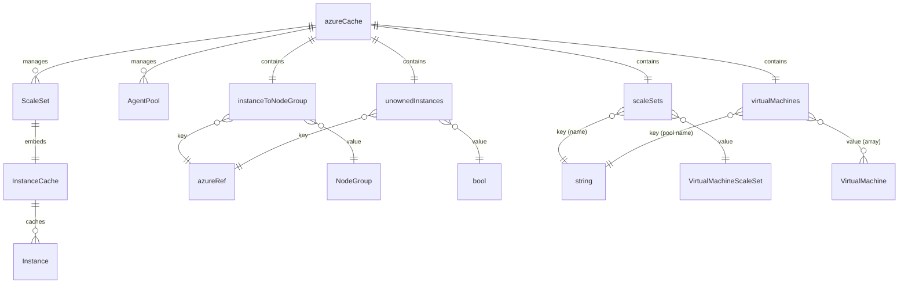

## 7. Performance Optimization Strategies

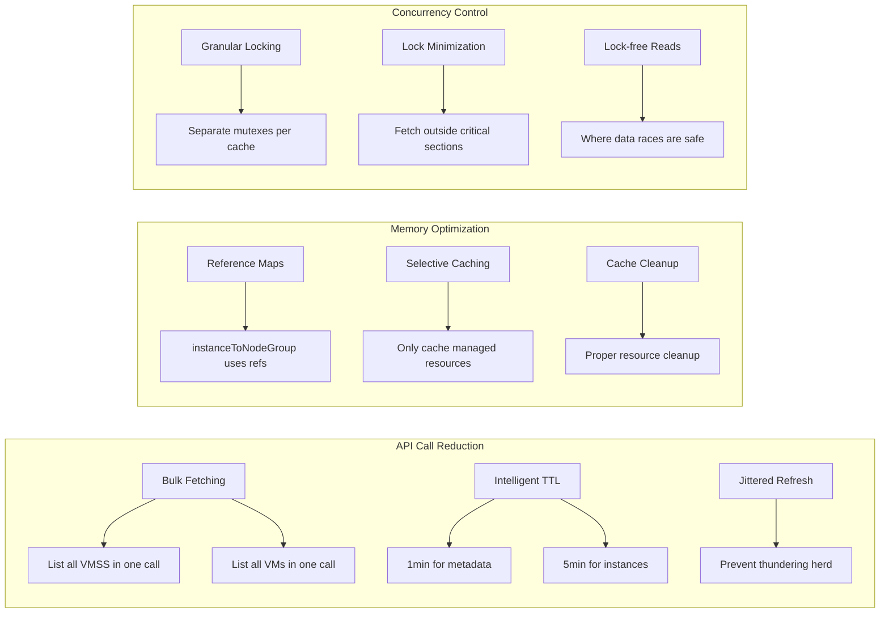

## 8. Cache Consistency Patterns

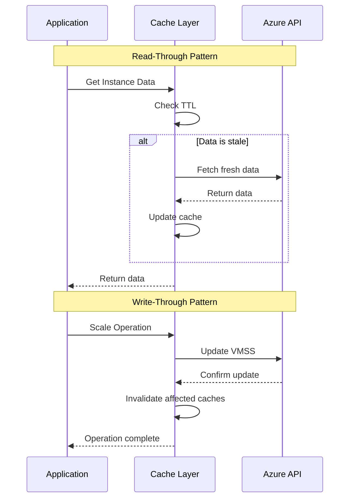

## 9. Mode Comparison Matrix

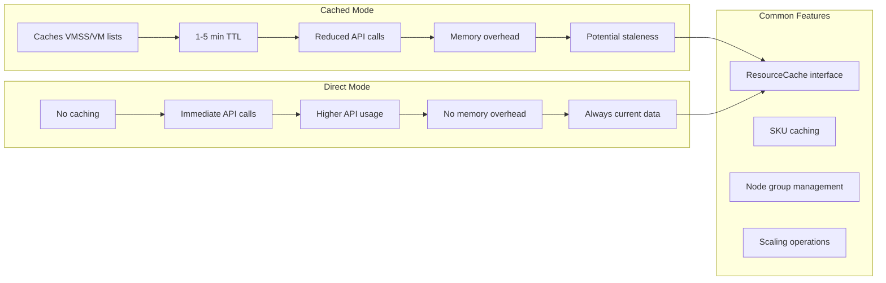

## 10. Implementation Architecture

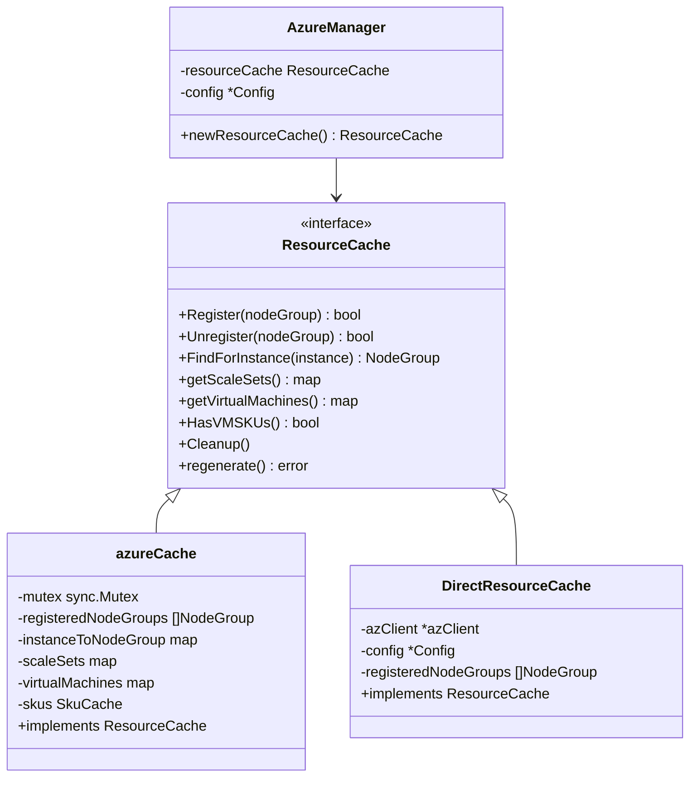

These diagrams illustrate how the Azure cloud provider implements both a sophisticated multi-layered caching system and a streamlined direct API mode. The cached mode balances performance with data consistency using time-based invalidation and intelligent refresh patterns, while the direct mode prioritizes data accuracy over API efficiency. Both modes share a common interface, allowing users to choose the optimal strategy for their specific Azure API performance characteristics and operational requirements.