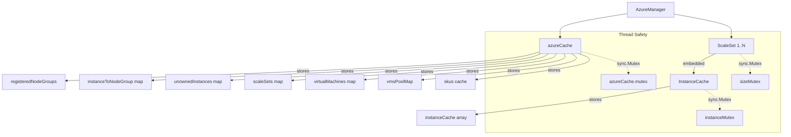
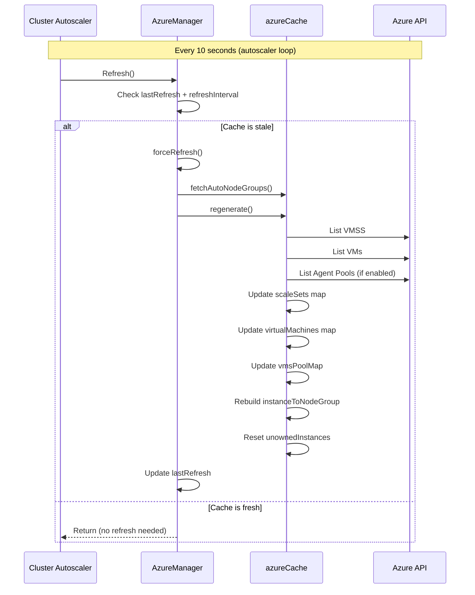
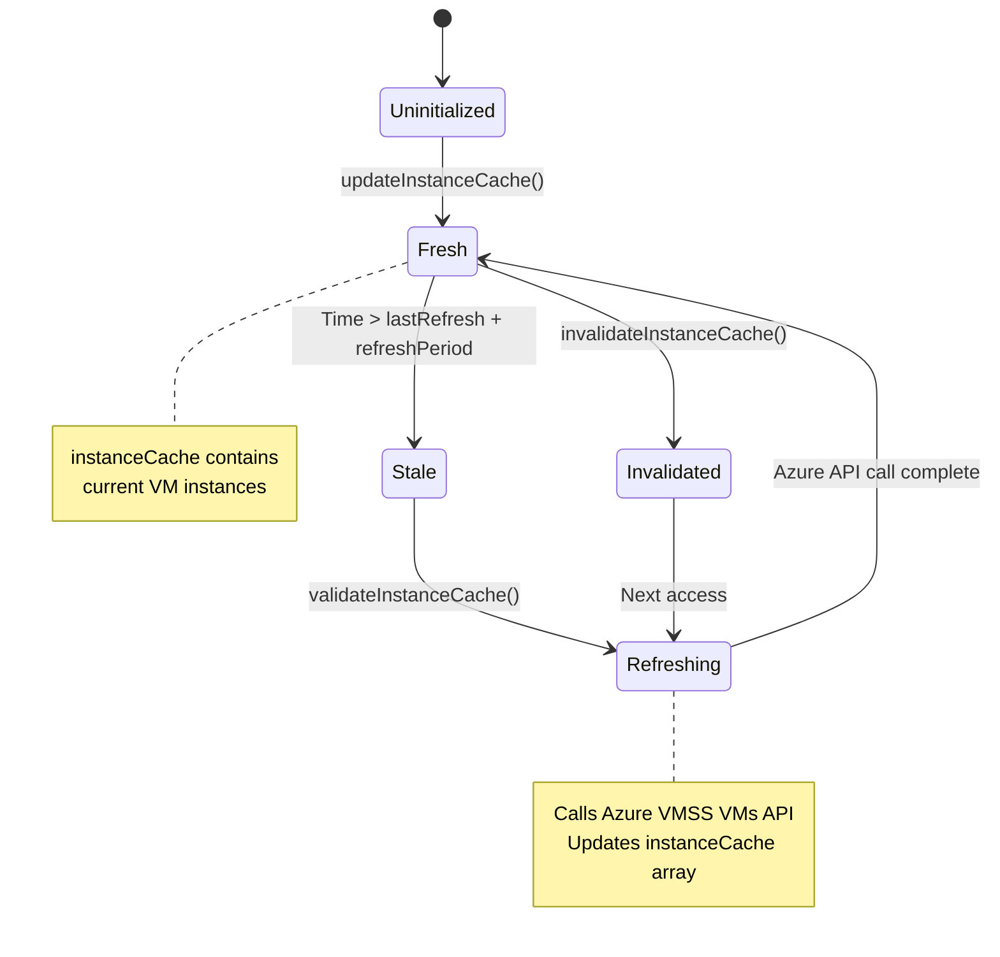
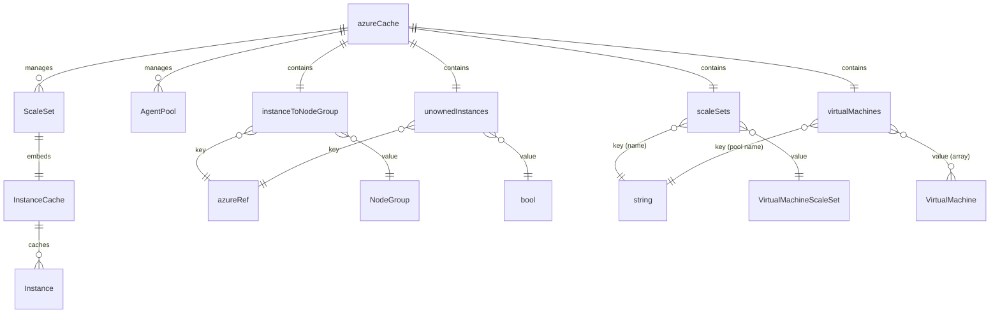
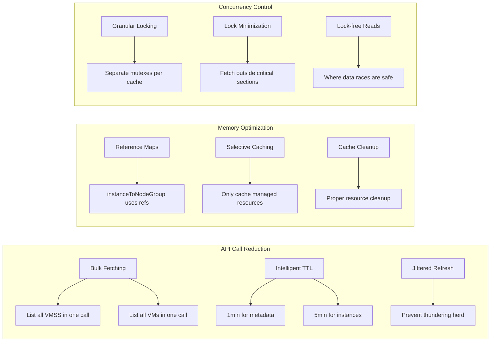
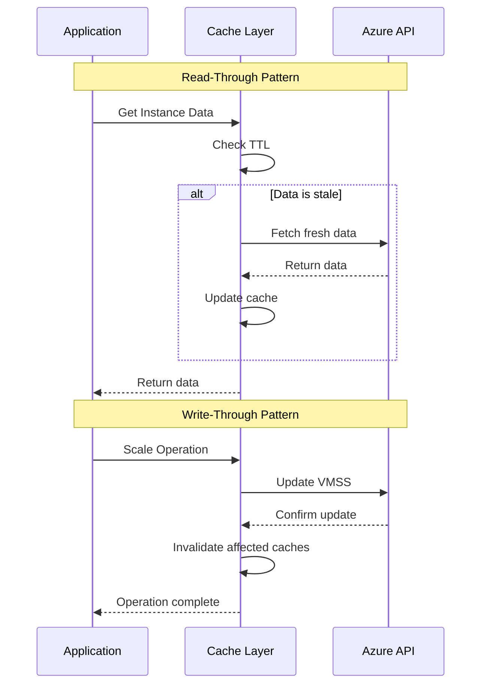

# Azure Cloud Provider Caching Architecture

The Azure cloud provider implements a sophisticated multi-layered caching system to optimize API calls and improve performance. Here's how it works:

## Core Cache Components

### 1. **azureCache** (`azure_cache.go:58-107`)
The main cache that tracks cluster resources:
- **Resource tracking**: Maps scale sets, VMs, and node pools
- **Instance-to-nodegroup mapping**: `instanceToNodeGroup` maps instances to their node groups
- **Refresh interval**: Configurable TTL (default 1 minute via `AZURE_VMSS_CACHE_TTL`)
- **Thread-safe**: Protected by `sync.Mutex`

### 2. **InstanceCache** (`azure_scale_set_instance_cache.go:55-71`)
Per-ScaleSet instance tracking:
- **Instance details**: Caches `cloudprovider.Instance` objects for each VMSS
- **Refresh period**: 5 minutes (configurable via `VmssVmsCacheTTL`)
- **Jitter support**: Prevents thundering herd with `instancesRefreshJitter`

### 3. **SKU Cache** (`azure_cache.go:126`)
VM SKU information cache:
- **Third-party library**: Uses `skewer.Cache` for Azure VM SKU data
- **Location-specific**: Filters SKUs by Azure region
- **Dynamic instance types**: Enables runtime SKU discovery

## Cache Hierarchies and Data Flow

### Main Cache Refresh Flow (`azure_manager.go:216-236`)
```
AzureManager.Refresh() → forceRefresh() → azureCache.regenerate()
├── fetchAzureResources() - Gets VMSS/VM lists from Azure API
├── Update instanceToNodeGroup mapping
└── Reset unownedInstances cache
```

### Instance Cache Refresh (`azure_scale_set_instance_cache.go:90-119`)
```
ScaleSet operations → validateInstanceCache() → updateInstanceCache()
├── Check lastInstanceRefresh + refreshPeriod vs current time
├── Call Azure VMSS VMs List API if stale
└── Update instanceCache with current VM status
```

### Resource Fetching Strategy (`azure_cache.go:233-260`)
1. **VMSS List**: `fetchScaleSets()` - Gets all scale sets in resource group
2. **VM List**: `fetchVirtualMachines()` - Gets standalone VMs grouped by agent pool
3. **VMs Pools**: `fetchVMsPools()` - Gets AKS VMs-type agent pools (if enabled)

## Cache Invalidation Patterns

### Automatic Invalidation
- **Time-based**: Each cache has its own TTL (1min azureCache, 5min instanceCache)
- **On registration changes**: `invalidateUnownedInstanceCache()` when node groups change
- **On scaling operations**: `invalidateInstanceCache()` forces immediate refresh

### Manual Invalidation (`azure_manager.go:238-243`)
- **Force refresh**: `invalidateCache()` sets `lastRefresh` to past time
- **Triggered by**: Node group registration/unregistration, scaling operations

## Cache Access Patterns

### Read Operations
- **GetNodeGroupForInstance**: `azureCache.FindForInstance()` uses `instanceToNodeGroup` map
- **ScaleSet.Nodes()**: Returns cached instances from `InstanceCache.instanceCache`
- **Instance lookups**: `getInstanceByProviderID()` searches instance cache

### Write Operations
- **Registration**: Updates `registeredNodeGroups` and rebuilds mappings
- **Status updates**: `setInstanceStatusByProviderID()` modifies cached instance status
- **Scaling decisions**: Updates both size tracking and instance caches

## Performance Optimizations

### Locking Strategy
- **Granular locks**: Separate mutexes for different cache components
- **Lock-free reads**: Some operations use lock-free patterns where safe
- **Minimize critical sections**: Fetch data outside locks, then update atomically

### Batch Operations
- **Bulk fetching**: Single API calls retrieve multiple resources
- **Parallel updates**: Multiple caches can refresh concurrently
- **Jittered refresh**: Prevents simultaneous cache refreshes across scale sets

### Memory Efficiency
- **Reference sharing**: Maps use references to avoid data duplication  
- **Selective caching**: Only caches actively managed resources
- **Cleanup**: `azureCache.Cleanup()` properly closes channels and releases resources

The caching system balances data freshness with API rate limiting, using configurable TTLs and intelligent invalidation to ensure the cluster autoscaler has current resource state while minimizing expensive Azure API calls.

# Azure Cloud Provider Caching Architecture Diagrams

## 1. Cache Component Hierarchy



## 2. Cache Refresh Flow



## 3. Instance Cache Lifecycle



## 4. Data Flow for Node Group Operations

```mermaid
flowchart TD
    subgraph "Node Group Lookup"
        A[GetNodeGroupForInstance] --> B[azureCache.FindForInstance]
        B --> C{Check unownedInstances}
        C -->|Found| D[Return nil]
        C -->|Not found| E[Search instanceToNodeGroup]
        E -->|Found| F[Return NodeGroup]
        E -->|Not found| G[Return nil + cache as unowned]
    end
    
    subgraph "Instance Operations"
        H[ScaleSet.Nodes] --> I[validateInstanceCache]
        I --> J{Cache valid?}
        J -->|Yes| K[Return cached instances]
        J -->|No| L[updateInstanceCache]
        L --> M[Call Azure VMSS VMs API]
        M --> N[Update instanceCache]
        N --> K
    end
    
    subgraph "Scaling Operations"
        O[Scale Up/Down] --> P[Update Azure VMSS]
        P --> Q[invalidateInstanceCache]
        Q --> R[Force refresh on next access]
    end
```



## 5. Cache Invalidation Triggers

```mermaid
mindmap
  root((Cache Invalidation))
    Time Based
      azureCache: 1 min default
      instanceCache: 5 min default
      SKU cache: Session based
    Operation Based
      Node Group Registration
        Register new group
        Unregister group
        Update min/max size
      Scaling Operations
        Scale up instances
        Scale down instances
        Delete instances
      Configuration Changes
        Auto-discovery changes
        Explicit config updates
    Manual Triggers
      forceRefresh()
      invalidateCache()
      invalidateInstanceCache()
```

## 6. Memory Layout and Relationships



## 7. Performance Optimization Strategies



## 8. Cache Consistency Patterns



These diagrams illustrate how the Azure cloud provider implements a sophisticated multi-layered caching system that balances performance with data consistency, using time-based invalidation, intelligent refresh patterns, and careful concurrency control to minimize Azure API calls while maintaining accurate cluster state.