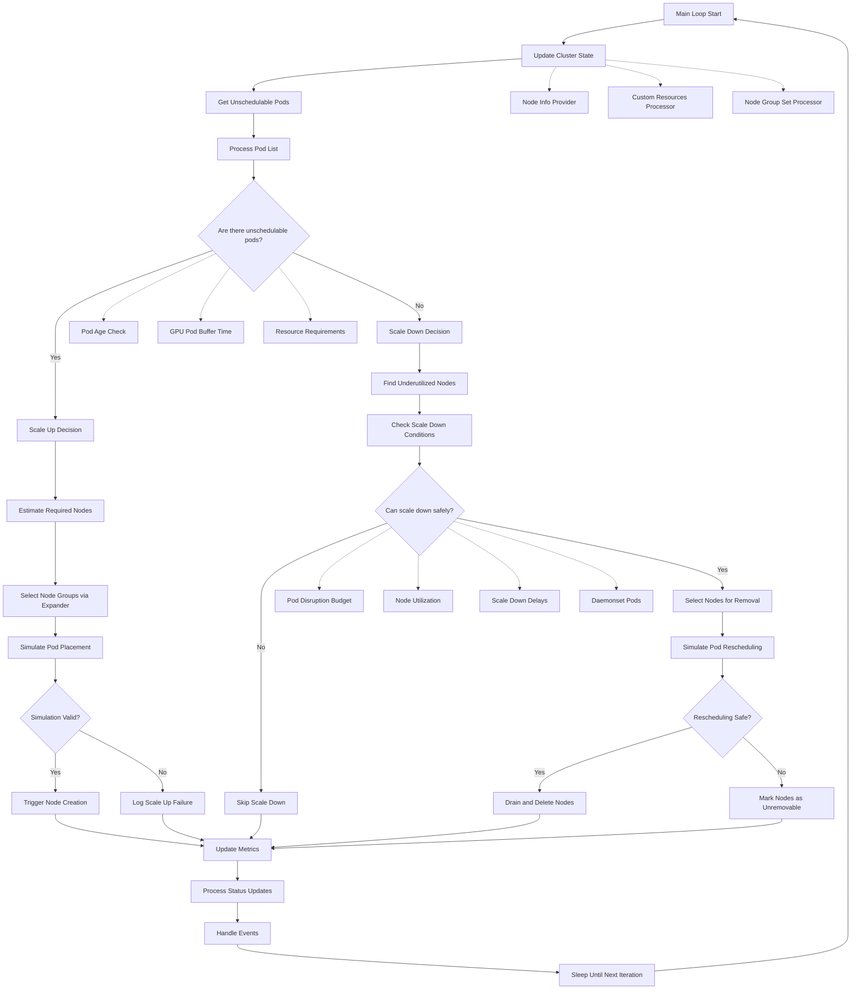

# Kubernetes Cluster Autoscaler Main Control Loop

This diagram shows the main control loop of the Kubernetes Cluster Autoscaler, illustrating how it makes scaling decisions based on cluster state and workload demands.

## Key Components

### Scale Up Path
- **Estimate Required Nodes**: Uses bin-packing algorithms to determine resource needs
- **Select Node Groups**: Applies expander strategies (random, priority, cost-based, etc.)
- **Simulate Pod Placement**: Validates that pods can actually be scheduled on new nodes
- **Trigger Node Creation**: Calls cloud provider APIs to create new nodes

### Scale Down Path
- **Find Underutilized Nodes**: Identifies nodes with low resource utilization
- **Check Scale Down Conditions**: Validates safety constraints and delays
- **Simulate Pod Rescheduling**: Ensures pods can be moved to other nodes
- **Drain and Delete Nodes**: Safely removes nodes after moving workloads

### Decision Points
- **Unschedulable Pods Check**: Determines whether scale up is needed
- **Simulation Validation**: Ensures scaling actions are safe and effective
- **Safety Checks**: Validates Pod Disruption Budgets, node utilization, and other constraints

### Processing Pipeline
- **Update Cluster State**: Refreshes node and pod information
- **Process Pod List**: Filters and categorizes pods
- **Update Metrics**: Publishes monitoring data
- **Handle Events**: Processes Kubernetes events and status updates

The loop runs continuously, making incremental scaling decisions to maintain optimal cluster capacity while ensuring workload availability and cost efficiency.

